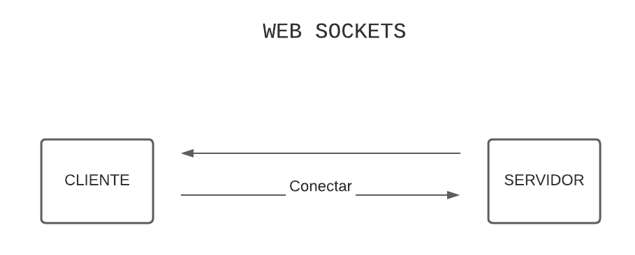

# AULA 04 - Landing

O que é websocket, como se utiliza e a diferença para o protocolo http

## Diferença do protocolo WEBSOCKET para o protocolo HTTP

### **HTTP**:

A cada requisição do cliente para o servidor, é aberta uma conexão entre o cliente e o servidor. O tempo de vida dessa conexão é a cada requisição. Então quando o servidor envia uma resposta ao cliente, ele encerra a conexão.


### **WEB SOCKETS**:

O cliente precisa se conectar ao servidor para abrir uma requisição. Uma conexão só se encerra quando o cliente se desconectar do web sockets. Então vira uma comunicação bidirecional.



---

## Biblioteca Web Socket para o node

Usaremos a [socket.io](https://www.npmjs.com/package/socket.io)

### Instalação

```bash
// with npm
npm install socket.io

// with yarn
yarn add socket.io
```

Instalando tipagens

```bash
yarn add @types/socket.io -D
```

### How to use

The following example attaches socket.io to a plain Node.JS HTTP server listening on port `3000`.

```ts
const server = require('http').createServer();
const io = require('socket.io')(server);
io.on('connection', (client) => {
  client.on('event', (data) => {
    /* … */
  });
  client.on('disconnect', () => {
    /* … */
  });
});
server.listen(3000);
```

#### Standalone

```ts
const io = require('socket.io')();
io.on('connection', client => { ... });
io.listen(3000);
```

#### In conjunction with Express

Starting with 3.0, express applications have become request handler functions that you pass to `http` or `http Server` instances. You need to pass the `Server` to `socket.io`, and not the express application function. Also make sure to call `.listen` on the `server`, not the `app`.

```ts
const app = require('express')();
const server = require('http').createServer(app);
const io = require('socket.io')(server);
io.on('connection', () => {
  /* … */
});
server.listen(3000);
```

#### **At project**:

```ts
import express from 'express';
import { createServer } from 'http';
import { Server, Socket } from 'socket.io';

import './database';
import { routes } from './routes';

const app = express();

const http = createServer(app); // Criando protocolo http
const io = new Server(http); // Criando protocolo ws

io.on('connection', (socket: Socket) => {
  console.log('Se conectou', socket.id);
});

app.use(express.json());
app.use(routes);

http.listen(3333, () => console.log(`Server is running on port 3333`));
```
