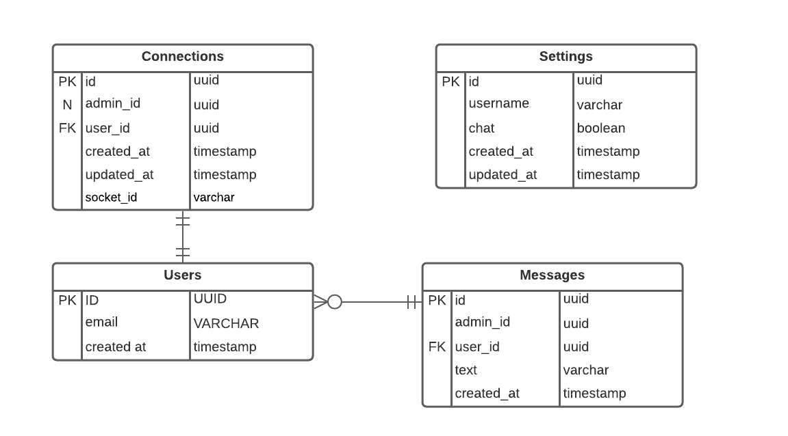

# PROJETO NLW5 - ELIXIR

## Rodar

```bash
yarn dev
```

## DER



**PK (Primary Key)**: Chave primária que serve como identificador do registro  
**N**: Este atributo pode ter o valor nulo  
**FK (Primary Key)**: Chave estrangeira, que é todo identificador que vem de outra tabela
